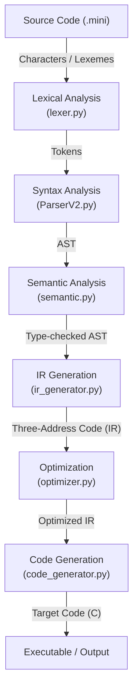
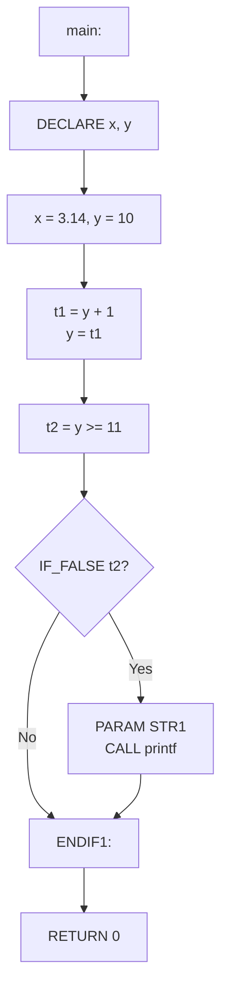

# MiNi-C-Compiler-by-Huzefa
This is my semester project for the course Compiler Construction. It is a group project in which I designed, implemented and tested the Lexical Analyzer.


Mini-C Compiler is a complete compiler implementation that translates a subset of C language into executable code. It demonstrates all major phases of compilation: lexical analysis, parsing, semantic analysis, intermediate representation, optimization, and code generation.

# **Key Features**

Complete lexical analysis with error recovery
Recursive descent parser with AST generation
Semantic analysis with type checking
Three-Address Code (TAC) intermediate representation
Multi-level optimization (-O0, -O1, -O2)
Target code generation (C code output)
Comprehensive error reporting

# **Installation & Usage**

## Basic Usage

### Step 1: Compile with Mini-C Compiler
python compiler.py test.mini --target=c

### Step 2: Compile generated C code with GCC
gcc test.c -o test

### Step 3: Run the executable
./test

---

## Architecture



---

## Installation & Usage

### Basic Usage

```bash
# Step 1: Compile with Mini-C Compiler
python compiler.py test.mini --target=c

# Step 2: Compile generated C code with GCC
gcc test.c -o test

# Step 3: Run the executable
./test
```

### Command Line Options

| Option | Description |
| --- | --- |
| `-O0` | No optimization |
| `-O1` | Basic optimization |
| `-O2` | Full optimization (default) |
| `--target=c` | Generate C code (default) |
| `--ast` | Show Abstract Syntax Tree |
| `--ir` | Show Intermediate Representation |
| `--all` | Show all compilation phases |

### Examples

```bash
# Compile with full optimization (default)
python [compiler.py](http://compiler.py) [program.mini](http://program.mini)
python compiler.py program.mini

# Compile with no optimization
python compiler.py program.mini -O0

# Show all phases
python [compiler.py](http://compiler.py) [program.mini](http://program.mini) --all
python compiler.py program.mini --all

# Generate C code
python [compiler.py](http://compiler.py) [program.mini](http://program.mini) --target=c
python compiler.py program.mini --target=c
```

---

## Language Specification

### Data Types

| Type | Description | Size | Example |
| --- | --- | --- | --- |
| `int` | Integer | 4 bytes | `42`, `-10` |
| `float` | Floating point | 4 bytes | `3.14`, `-0.5` |
| `char` | Character | 1 byte | `'a'`, `'\\n'` |
| `void` | No value | - | Function return |

### Operators

**Arithmetic:** `+`, `-`, `*`, `/`, `%`

**Comparison:** `==`, `!=`, `<`, `>`, `<=`, `>=`

**Logical:** `&&`, `||`, `!`

**Assignment:** `=`, `+=`, `-=`, `*=`, `/=`

**Increment/Decrement:** `++`, `--`

### Control Structures

**If Statement:**

```c
if (condition) {
    // then block
} else {
    // else block (optional)
}
```

**While Loop:**

```c
while (condition) {
    // body
}
```

**For Loop:**

```c
for (init; condition; update) {
    // body
}
```

**Break/Continue:**

```c
while (1) {
    if (condition) break;
    if (other) continue;
}
```

### Functions

**Declaration:**

```c
return_type function_name(type param1, type param2) {
    // body
    return value;
}
```

**Standard Library:**

- `printf()` - Print formatted output
- `scanf()` - Read formatted input
- `malloc()` - Allocate memory
- `free()` - Free memory

---

## Module Reference

### lexer.py

**Purpose:** Tokenizes source code into a stream of tokens

**Classes:**

- `Token`: Represents a single token with type, lexeme, line, and column
- `Lexer`: Main tokenizer class

**Key Methods:**

```python
lexer = Lexer(filename)
lexer.tokenize()
tokens = lexer.get_tokens()
lexer.write_tokens_file()
lexer.write_symbol_table()
```

**Features:**

- Keyword recognition
- Operator tokenization
- String/character literal handling
- Comment stripping (// and /* */)
- Line and column tracking
- Error reporting

---

### ParserV2.py

**Purpose:** Parses tokens into an Abstract Syntax Tree (AST)

**Classes:**

- `ASTNode`: Base class for all AST nodes
- `Parser`: Recursive descent parser
- `SymbolTable`: Parser-level symbol table
- Various node classes: `Program`, `FunctionDeclaration`, `Block`, `VarDeclaration`, `Assignment`, etc.

**Key Methods:**

```python
parser = Parser(tokens)
ast = parser.parse()
print_ast(ast)
```

**Features:**

- Recursive descent parsing
- Error recovery with synchronization
- Symbol table for declarations
- Expression precedence handling
- Control flow validation (break/continue in loops)
- Function scope tracking

---

### semantic.py

**Purpose:** Performs semantic analysis and type checking

**Classes:**

- `SemanticAnalyzer`: Main semantic checker
- `SemanticSymbolTable`: Scoped symbol management
- `SemanticError`: Exception for semantic errors

**Key Methods:**

```python
analyzer = SemanticAnalyzer()
analyzer.analyze(ast)
```

**Checks Performed:**

- Variable declaration before use
- Type compatibility in operations
- Function signature validation
- Return type checking
- Scope management
- Implicit type conversion (int → float)

---

### ir_generator.py

**Purpose:** Generates Three-Address Code (TAC) intermediate representation

**Classes:**

- `IRInstruction`: Single IR instruction representation
- `IRGenerator`: AST to IR translator

**Key Methods:**

```python
ir_gen = IRGenerator()
instructions = ir_gen.generate(ast)
```

**Features:**

- Temporary variable generation
- Label generation for control flow
- String literal management
- Loop label tracking (break/continue)
- Function scope tracking
- Variable type tracking

**Generated Data:**

- `instructions`: List of IR instructions
- `string_literals`: Dictionary mapping labels to strings
- `var_types`: Dictionary mapping variable names to types

---

### optimizer.py

**Purpose:** Optimizes IR code to improve efficiency

**Classes:**

- `Optimizer`: IR optimization engine

**Key Methods:**

```python
optimizer = Optimizer(optimization_level=2)
optimized = optimizer.optimize(instructions)
optimizer.print_stats()  # Only shows if level > 0
```

**Optimization Techniques:**

**Level 0 (-O0):** No optimization

- IR passed through unchanged
- No statistics displayed

**Level 1 (-O1):** Basic optimization

- Constant folding (compile-time expression evaluation)
- Dead code elimination (unused temporary removal)
- Statistics displayed

**Level 2 (-O2):** Full optimization (default)

- All -O1 optimizations
- Strength reduction (expensive → cheap operations)
- Statistics displayed

**Important Note:** The optimizer only folds expressions where BOTH operands are literal constants, never when variables are involved. This prevents incorrect optimization of runtime-dependent comparisons.

---

### code_generator.py

**Purpose:** Generates target C code from optimized IR

**Classes:**

- `CodeGenerator`: Target code generator

**Key Methods:**

```python
gen = CodeGenerator(target='c')
code = gen.generate(ir, string_literals, var_types)
```

**Features:**

- C header generation
- Variable declaration grouping by type
- Temporary variable declaration
- String literal substitution
- Control flow preservation (goto-based)
- Type-preserving code generation

---

## Detailed Phase Examples

### Example Program

```c
int main() {
    float x = 3.14;
    int y = 10;

    // Increment y
    y += 1;

    if (y >= 11) {
        printf("Reached target!\\n");
    }

    return 0;
}
```

---

## PHASE 1: LEXICAL ANALYSIS

### Input

```
Raw source code: 145 characters
```

### Process

- Scan character by character
- Group into tokens
- Skip whitespace and comments
- Build symbol table

### Output: Tokens (34 tokens)

```
Token(KEYWORD, 'int', 1, 1)
Token(IDENTIFIER, 'main', 1, 5)
Token(LPAREN, '(', 1, 9)
Token(RPAREN, ')', 1, 10)
Token(LBRACE, '{', 1, 12)
Token(KEYWORD, 'float', 2, 5)
Token(IDENTIFIER, 'x', 2, 11)
Token(OPERATOR, '=', 2, 13)
Token(FLOAT_LITERAL, '3.14', 2, 15)
Token(SEMICOLON, ';', 2, 19)
Token(KEYWORD, 'int', 3, 5)
Token(IDENTIFIER, 'y', 3, 9)
Token(OPERATOR, '=', 3, 11)
Token(INTEGER_LITERAL, '10', 3, 13)
Token(SEMICOLON, ';', 3, 15)
Token(IDENTIFIER, 'y', 5, 5)
Token(OPERATOR, '+=', 5, 7)
Token(INTEGER_LITERAL, '1', 5, 10)
Token(SEMICOLON, ';', 5, 11)
Token(KEYWORD, 'if', 6, 5)
Token(LPAREN, '(', 6, 8)
Token(IDENTIFIER, 'y', 6, 9)
Token(OPERATOR, '>=', 6, 11)
Token(INTEGER_LITERAL, '11', 6, 14)
Token(RPAREN, ')', 6, 16)
Token(LBRACE, '{', 6, 18)
Token(IDENTIFIER, 'printf', 7, 9)
Token(LPAREN, '(', 7, 15)
Token(STRING_LITERAL, '"Reached target!\\n"', 7, 16)
Token(RPAREN, ')', 7, 35)
Token(SEMICOLON, ';', 7, 36)
Token(RBRACE, '}', 8, 5)
Token(KEYWORD, 'return', 9, 5)
Token(INTEGER_LITERAL, '0', 9, 12)
Token(SEMICOLON, ';', 9, 13)
Token(RBRACE, '}', 10, 1)
Token(EOF, '$', 10, 2)
```

### Symbol Table

```
Name                    Category
main                    identifier
x                       identifier
y                       identifier
printf                  identifier
3.14                    literal
10                      literal
1                       literal
11                      literal
"Reached target!\\n"     literal
0                       literal
```

### Summary

- **Input**: 145 characters
- **Output**: 34 tokens
- **Comments**: 1 (stripped)
- **Identifiers**: 4 unique (main, x, y, printf)
- **Literals**: 6 (3.14, 10, 1, 11, string, 0)

---

## PHASE 2: SYNTAX ANALYSIS (PARSING)

### Input

```
34 tokens from Phase 1
```

### Process

- Recursive descent parsing
- Build Abstract Syntax Tree
- Match grammar rules
- Create AST nodes

### Output: Abstract Syntax Tree

```
Program
  [0]: FunctionDeclaration(int main)
       params: []
       body:
         Block
           [0]: VarDeclaration(float x)
                value: Number(3.14)
           [1]: VarDeclaration(int y)
                value: Number(10)
           [2]: CompoundAssignment(y +=)
                value: Number(1)
           [3]: IfStatement
                condition: ComparisonOp('>=')
                  left: Identifier(y)
                  right: Number(11)
                then:
                  Block
                    [0]: FunctionCall(printf)
                         arg[0]: String("Reached target!\\n")
                else: None
           [4]: ReturnStatement
                value: Number(0)
```

### AST Structure Breakdown

```
Program (root)
└── FunctionDeclaration: main (int)
    └── Block (5 statements)
        ├── VarDeclaration: x (float)
        │   └── Initializer: Number(3.14)
        ├── VarDeclaration: y (int)
        │   └── Initializer: Number(10)
        ├── CompoundAssignment: y +=
        │   └── Value: Number(1)
        ├── IfStatement
        │   ├── Condition: ComparisonOp (>=)
        │   │   ├── Left: Identifier(y)
        │   │   └── Right: Number(11)
        │   └── Then Block
        │       └── FunctionCall: printf
        │           └── Argument: String("Reached target!\\n")
        └── ReturnStatement
            └── Value: Number(0)
```

### Summary

- **Input**: 34 tokens
- **Output**: 14 AST nodes
- **Tree Depth**: 5 levels
- **Errors**: 0

---

## PHASE 3: SEMANTIC ANALYSIS

### Input

```
Abstract Syntax Tree (14 nodes from Phase 2)
```

### Process

- Build scoped symbol table
- Type checking
- Declaration validation
- Function signature verification

### Output: Validated AST + Symbol Table

### Symbol Table (Scoped)

```
Global Scope:
  main: function:int
  printf: function:int (stdlib)
  scanf: function:int (stdlib)
  malloc: function:void* (stdlib)
  free: function:void (stdlib)

Function Scope (main):
  x: float
  y: int
```

### Semantic Checks Performed

```
✓ Line 1: Function 'main' declared with return type 'int'
✓ Line 2: Variable 'x' declared with type 'float'
✓ Line 2: Assignment to 'x' - literal 3.14 is type 'float' ✓
✓ Line 3: Variable 'y' declared with type 'int'
✓ Line 3: Assignment to 'y' - literal 10 is type 'int' ✓
✓ Line 5: Compound assignment 'y +=' - operand is type 'int' ✓
✓ Line 5: Type check - 'y' (int) += 1 (int) ✓
✓ Line 6: Comparison 'y >= 11' - both operands type 'int' ✓
✓ Line 7: Function call 'printf' - found in symbol table ✓
✓ Line 7: Argument type - string literal ✓
✓ Line 9: Return statement - type 'int' matches function return type ✓
```

### Summary

- **Input**: 14 AST nodes
- **Output**: Type-checked AST
- **Variables Declared**: 2 (x: float, y: int)
- **Functions Called**: 1 (printf)
- **Type Errors**: 0
- **Semantic Errors**: 0

---

## PHASE 4: IR GENERATION (Three-Address Code)

### Input

```
Validated AST from Phase 3
```

### Process

- Visit each AST node
- Generate TAC instructions
- Create temporary variables
- Generate labels for control flow
- Track string literals

### Output: Unoptimized IR (14 instructions)

```
main:
    DECLARE float x
    DECLARE int y
    x = 3.14
    y = 10
    t1 = y + 1
    y = t1
    t2 = y >= 11
    IF_FALSE t2 GOTO ENDIF1
    PARAM STR1
    t3 = CALL printf, 1
ENDIF1:
    RETURN 0
    END_FUNC main
```

### String Literals Table

```
STR1: "Reached target!\\n"
```

### Variable Types Table

```
x: float
y: int
t1: int (temporary)
t2: int (temporary - comparison result)
t3: int (temporary - printf return value)
```

### IR Instruction Breakdown

| # | Instruction | Type | Description |
| --- | --- | --- | --- |
| 1 | `main:` | Label | Function entry point |
| 2 | `DECLARE float x` | Declaration | Declare float variable x |
| 3 | `DECLARE int y` | Declaration | Declare int variable y |
| 4 | `x = 3.14` | Assignment | Initialize x with 3.14 |
| 5 | `y = 10` | Assignment | Initialize y with 10 |
| 6 | `t1 = y + 1` | Arithmetic | Compute y + 1 |
| 7 | `y = t1` | Assignment | Store result in y (y += 1) |
| 8 | `t2 = y >= 11` | Comparison | Check if y >= 11 |
| 9 | `IF_FALSE t2 GOTO ENDIF1` | Conditional Jump | Skip if block if false |
| 10 | `PARAM STR1` | Parameter Setup | Push string argument |
| 11 | `t3 = CALL printf, 1` | Function Call | Call printf with 1 argument |
| 12 | `ENDIF1:` | Label | End of if statement |
| 13 | `RETURN 0` | Return | Return 0 from main |
| 14 | `END_FUNC main` | Function End | Function epilogue |

### Control Flow Graph



### Summary

- **Input**: 14 AST nodes
- **Output**: 14 IR instructions
- **Temporaries Created**: 3 (t1, t2, t3)
- **Labels Created**: 2 (main, ENDIF1)
- **String Literals**: 1

---

## PHASE 5: CODE OPTIMIZATION (-O2)

### Input

```
14 IR instructions from Phase 4
```

### Process

Apply optimization passes:

### Pass 1: Constant Folding

**Checks:**

- `t1 = y + 1`: y is a variable (not constant) → No folding
- No pure constant arithmetic found

**Result:** 0 optimizations

### Pass 2: Dead Code Elimination

**Analysis:**

- `t1`: Used in assignment to y ✓ (keep)
- `t2`: Used in IF_FALSE condition ✓ (keep)
- `t3`: Holds printf return value ✓ (keep)

**Result:** 0 dead code removals

### Pass 3: Strength Reduction

**Checks:**

- No multiplication by constants
- No identity operations (x * 1, x + 0)

**Result:** 0 reductions

### Output: Optimized IR (14 instructions)

```
main:
    DECLARE float x
    DECLARE int y
    x = 3.14
    y = 10
    t1 = y + 1
    y = t1
    t2 = y >= 11
    IF_FALSE t2 GOTO ENDIF1
    PARAM STR1
    t3 = CALL printf, 1
ENDIF1:
    RETURN 0
    END_FUNC main
```

### Optimization Statistics

```
==================================================
OPTIMIZATION STATISTICS
==================================================
  Constant Folding: 0
  Dead Code Eliminated: 0
  Strength Reduction: 0
  ──────────────────────────────
  Total Optimizations: 0
==================================================
```

### Why No Optimizations?

1. **No Constant Folding**: All arithmetic involves variables (y + 1), not pure constants
2. **No Dead Code**: All temporaries are used in subsequent operations
3. **No Strength Reduction**: No multiplication by constants or identity operations
4. **Runtime Values**: Variable y's value is determined at runtime, preventing compile-time evaluation

**Note:** This is expected behavior - the code is already efficient. The optimizer correctly avoids folding expressions involving variables.

### Summary

- **Input**: 14 IR instructions
- **Output**: 14 IR instructions (unchanged)
- **Optimization Gain**: 0 instructions removed (0% reduction)
- **Status**: Code already optimal

---

## PHASE 6: CODE GENERATION (Target: C)

### Input

```
14 IR instructions from Phase 5
String Literals: {STR1: "Reached target!\\n"}
Variable Types: {x: float, y: int, t1: int, t2: int, t3: int}
```

### Process

1. Generate C headers (`stdio.h`, `stdlib.h`)
2. Declare all variables at function start (grouped by type)
3. Declare all temporaries
4. Add blank line after declarations
5. Translate each IR instruction to C
6. Handle string literal substitution
7. Format with proper indentation

### Output: Generated C Code

```c
/* Generated C Code */
#include <stdio.h>
#include <stdlib.h>

int main() {
    float x;
    int y;
    int t1, t2, t3;

    x = 3.14;
    y = 10;
    t1 = y + 1;
    y = t1;
    t2 = (y >= 11);
    if (!t2) goto ENDIF1;
    t3 = printf("Reached target!\\n");
ENDIF1:;
    return 0;
}
```

### IR to C Mapping

| IR Instruction | Generated C Code |
| --- | --- |
| `main:` | `int main() {` |
| `DECLARE float x` | `float x;` (grouped) |
| `DECLARE int y` | `int y;` (grouped) |
| (temporaries) | `int t1, t2, t3;` (grouped) |
| (blank line) | (after declarations) |
| `x = 3.14` | `x = 3.14;` |
| `y = 10` | `y = 10;` |
| `t1 = y + 1` | `t1 = y + 1;` |
| `y = t1` | `y = t1;` |
| `t2 = y >= 11` | `t2 = (y >= 11);` |
| `IF_FALSE t2 GOTO ENDIF1` | `if (!t2) goto ENDIF1;` |
| `PARAM STR1` | (combined with CALL) |
| `t3 = CALL printf, 1` | `t3 = printf("Reached target!\\n");` |
| `ENDIF1:` | `ENDIF1:;` |
| `RETURN 0` | `return 0;` |
| `END_FUNC main` | `}` |

### Code Generation Features

1. **Variable Grouping**: Variables declared at function start, grouped by type
2. **Temporary Declaration**: All temps declared together (`t1, t2, t3`)
3. **Blank Line**: Added after all declarations for readability
4. **String Substitution**: `STR1` → `"Reached target!\\n"`
5. **Control Flow**: Goto-based (faithful to IR structure)
6. **Type Preservation**: float/int distinction maintained
7. **Standard Headers**: `stdio.h` for printf, `stdlib.h` included

### C Code Structure

```
1. Comment header
2. Standard includes
3. Blank line
4. Function signature
5. Variable declarations (grouped by type)
6. Temporary declarations
7. Blank line after declarations
8. Function body (statements)
9. Labels (at statement level)
10. Return statement
11. Closing brace
```

### Summary

- **Input**: 14 IR instructions
- **Output**: 19 lines of C code
- **Functions Used**: printf (stdlib)
- **Variables**: 2 user variables + 3 temporaries = 5 total
- **Generated Lines**: 19 (including headers, braces, blank lines)

---

## COMPLETE COMPILATION SUMMARY

```
╔══════════════════════════════════════════════════════════════════╗
║                     MINI-C COMPILER                              ║
║                                                                  ║
║  Phases: Lexer → Parser → Semantic → IR → Optimizer → CodeGen    ║
╚══════════════════════════════════════════════════════════════════╝
    
======================================================================
PHASE 1: LEXICAL ANALYSIS
======================================================================
✅ Lexical analysis completed. (37 tokens)

======================================================================
PHASE 2: SYNTAX ANALYSIS (PARSING)
======================================================================
🔍 Starting parsing...
✅ Parsing completed successfully!
✅ Parsing completed successfully.

======================================================================
PHASE 3: SEMANTIC ANALYSIS
======================================================================
✅ Semantic analysis completed successfully.

======================================================================
PHASE 4: IR GENERATION (Three-Address Code)
======================================================================
✅ IR generated. (14 instructions)

======================================================================
PHASE 5: CODE OPTIMIZATION (Level: O2)
======================================================================
✅ Optimization completed. (14 instructions, 0 removed)

==================================================
OPTIMIZATION STATISTICS
==================================================
  ──────────────────────────────
  Total Optimizations: 0
==================================================

======================================================================
PHASE 6: CODE GENERATION (Target: C)
======================================================================
✅ Code generation completed.
📄 Output written to: test.c

======================================================================
COMPILATION SUMMARY
======================================================================

    Source File     : test.mini
    Output File     : test.c
    Target          : C
    Optimization    : O2
    
    Tokens          : 37
    IR Instructions : 14 → 14 (optimized)
    
    Status          : ✅ SUCCESS
    

📂 Additional files generated:
   - tokens.txt
   - symbol_table.txt
   - test_ir.txt

```

---

## Testing the Generated Code

### Compile and Run

```bash
# Step 1: Compile with Mini-C Compiler
python [compiler.py](http://compiler.py) [test.mini](http://test.mini) --target=c

# Step 2: Compile generated C code with GCC
gcc test.c -o test

# Step 3: Run the executable
./test
```

### Expected Output

```
Reached target!
```

### Verification

```bash
# Check exit code (should be 0)
echo $?
```

---

## Advanced Features

### Symbol Table Management

- **Hierarchical scoping**: Nested block support
- **Type tracking**: Records variable types
- **Function signatures**: Stores return types and parameters
- **Standard library**: Pre-loaded functions (printf, scanf, malloc, free)

### Control Flow

- **Break/continue**: Label stack tracking for correct jumps
- **Loop nesting**: Proper label management for nested loops
- **Structured jumps**: Goto-based control flow in IR

### Type System

- **Basic types**: int, float, char, void
- **Implicit conversion**: int → float allowed in assignments/arithmetic
- **Type inference**: Temporaries inherit types from operations
- **Function types**: Tracked as `function:<return_type>`

### Error Recovery

- **Synchronization points**: Semicolons, braces, keywords
- **Multiple errors**: Reports all errors found
- **Line tracking**: Precise error location reporting
- **Graceful degradation**: Continues parsing after errors

---

## Optimization Details

### Constant Folding Rules

**Only folds when BOTH operands are literal constants:**

```
✓ Folded:     t1 = 2 + 3        →  t1 = 5
✓ Folded:     t1 = 10 * 5       →  t1 = 50
✗ Not folded: t1 = x + 1        (x is variable)
✗ Not folded: t1 = y >= 11      (y is variable)
```

**Why this matters:**

- Prevents incorrect optimization of runtime-dependent expressions
- Preserves program semantics
- Comparison results depend on variable values at runtime

### Dead Code Elimination Rules

**Removes only unused temporaries:**

```
✓ Removed:    t1 = 5 (never used)
✗ Kept:       t2 = x + 1 (used in y = t2)
✗ Kept:       user variables (always kept)
```

### Strength Reduction Rules

**Replaces expensive operations:**

```
x * 0  →  0
x * 1  →  x
x * 2  →  x + x
x + 0  →  x
```

---

## File Extensions and Outputs

### Input Files

- `.mini` - Mini-C source code

### Output Files

- `.c` - Generated C code
- `tokens.txt` - Complete token listing
- `symbol_table.txt` - Symbol table dump
- `<filename>_ir.txt` - IR code (both unoptimized and optimized)

---

## Known Limitations

1. **No arrays**: Array declarations not supported
2. **No pointers**: Pointer operations not implemented (except in stdlib functions)
3. **Limited stdlib**: Only 4 standard functions (printf, scanf, malloc, free)
4. **No preprocessor**: No #include, #define support
5. **Single file**: No multi-file compilation
6. **No structs/unions**: Only basic types supported

---

## Future Enhancements

- Array support
- Pointer arithmetic
- Structure definitions
- Multi-file compilation
- More optimization passes
- Better error messages
- x86-64 assembly generation (currently only C)

---

## Error Handling and Recovery

### Lexical Errors

**Examples:**

```
Invalid character: @
Unterminated string: "hello
```

**Recovery:**

- Reports error with line/column
- Skips invalid character
- Continues tokenization

### Syntax Errors

**Examples:**

```
Missing semicolon: x = 5
Unexpected token: if (x == 5
Mismatched braces: { x = 5;
```

**Recovery:**

- Synchronizes at semicolons, braces, or keywords
- Reports error with context
- Continues parsing

### Semantic Errors

**Examples:**

```
Undeclared variable: z = x + y;  // z not declared
Type mismatch: int x = "hello";
Return type mismatch: int main() { return "string"; }
```

**Recovery:**

- Reports all semantic errors
- Stops compilation before IR generation

---

## Troubleshooting

### Common Issues

**Problem:** "File not found"

```
Solution: Check filename and path
python [compiler.py](http://compiler.py) path/to/[file.mini](http://file.mini)
```

**Problem:** "Token mismatch" errors

```
Solution: Check for missing semicolons, braces, or parentheses
```

**Problem:** "Undeclared variable" errors

```
Solution: Declare variables before use with proper type
int x;
x = 10;
```

**Problem:** Generated C code won't compile

```
Solution: Check for:
- Proper string literal escaping
- Type compatibility
- Function signatures
```

---

## Appendix A: Grammar Reference

### Program Structure

```
program → declaration*

declaration → function_declaration
            | var_declaration

function_declaration → type IDENTIFIER '(' parameter_list ')' block

parameter_list → parameter (',' parameter)*
               | ε

parameter → type IDENTIFIER

var_declaration → type IDENTIFIER ('=' expression)? ';'
```

### Statements

```
statement → var_declaration
          | assignment
          | compound_assignment
          | if_statement
          | while_statement
          | for_statement
          | return_statement
          | break_statement
          | continue_statement
          | block
          | expression_statement

block → '{' statement* '}'

if_statement → 'if' '(' expression ')' statement ('else' statement)?

while_statement → 'while' '(' expression ')' statement

for_statement → 'for' '(' for_init? ';' expression? ';' for_update? ')' statement

return_statement → 'return' expression? ';'
```

### Expressions

```
expression → logical_or_expression

logical_or_expression → logical_and_expression ('||' logical_and_expression)*

logical_and_expression → equality_expression ('&&' equality_expression)*

equality_expression → relational_expression (('==' | '!=') relational_expression)*

relational_expression → additive_expression (('<' | '>' | '<=' | '>=') additive_expression)*

additive_expression → multiplicative_expression (('+' | '-') multiplicative_expression)*

multiplicative_expression → unary_expression (('*' | '/' | '%') unary_expression)*

unary_expression → '!' unary_expression
                 | primary_expression

primary_expression → INTEGER_LITERAL
                   | FLOAT_LITERAL
                   | STRING_LITERAL
                   | CHAR_LITERAL
                   | IDENTIFIER
                   | function_call
                   | '(' expression ')'

function_call → IDENTIFIER '(' argument_list ')'

argument_list → expression (',' expression)*
              | ε
```

---

## Appendix B: IR Instruction Set

### Complete Instruction Reference

| Instruction | Format | Description | Example |
| --- | --- | --- | --- |
| **ASSIGN** | `result = arg1` | Assignment | `x = 5` |
| **ADD** | `result = arg1 + arg2` | Addition | `t1 = x + y` |
| **SUB** | `result = arg1 - arg2` | Subtraction | `t2 = x - y` |
| **MUL** | `result = arg1 * arg2` | Multiplication | `t3 = x * y` |
| **DIV** | `result = arg1 / arg2` | Division | `t4 = x / y` |
| **MOD** | `result = arg1 % arg2` | Modulo | `t5 = x % y` |
| **EQ** | `result = arg1 == arg2` | Equal | `t6 = x == 5` |
| **NE** | `result = arg1 != arg2` | Not equal | `t7 = x != 5` |
| **LT** | `result = arg1 < arg2` | Less than | `t8 = x < 5` |
| **GT** | `result = arg1 > arg2` | Greater than | `t9 = x > 5` |
| **LE** | `result = arg1 <= arg2` | Less or equal | `t10 = x <= 5` |
| **GE** | `result = arg1 >= arg2` | Greater or equal | `t11 = x >= 5` |
| **AND** | `result = arg1 && arg2` | Logical AND | `t12 = a && b` |
| **OR** | `result = arg1 \ | \ | arg2` |
| **NOT** | `result = !arg1` | Logical NOT | `t14 = !a` |
| **LABEL** | `label:` | Label definition | `L1:` |
| **GOTO** | `GOTO label` | Unconditional jump | `GOTO L1` |
| **IF_FALSE** | `IF_FALSE arg GOTO label` | Conditional jump | `IF_FALSE t1 GOTO L2` |
| **IF_TRUE** | `IF_TRUE arg GOTO label` | Conditional jump | `IF_TRUE t1 GOTO L2` |
| **PARAM** | `PARAM arg` | Push parameter | `PARAM x` |
| **CALL** | `result = CALL func, n` | Function call | `t15 = CALL printf, 2` |
| **RETURN** | `RETURN arg` | Return from function | `RETURN 0` |
| **DECLARE** | `DECLARE type var` | Variable declaration | `DECLARE int x` |
| **FUNC_BEGIN** | `FUNC_BEGIN name` | Function start | `FUNC_BEGIN main` |
| **FUNC_END** | `FUNC_END name` | Function end | `FUNC_END main` |

---

## Appendix C: Example Programs

### Example 1: Factorial

```c
int factorial(int n) {
    int result = 1;
    int i;

    for (i = 1; i <= n; i += 1) {
        result *= i;
    }

    return result;
}

int main() {
    int x = 5;
    int fact = factorial(x);
    printf("Factorial: %d\\n", fact);
    return 0;
}
```

### Example 2: Fibonacci

```c
int fibonacci(int n) {
    if (n <= 1) {
        return n;
    }
    
    int a = 0;
    int b = 1;
    int i;
    
    for (i = 2; i <= n; i += 1) {
        int temp = a + b;
        a = b;
        b = temp;
    }
    
    return b;
}

int main() {
    int n = 10;
    int fib = fibonacci(n);
    printf("Fibonacci(%d) = %d\\n", n, fib);
    return 0;
}
```

### Example 3: Prime Check

```c
int isPrime(int n) {
    if (n <= 1) {
        return 0;
    }

    int i;
    for (i = 2; i * i <= n; i += 1) {
        if (n % i == 0) {
            return 0;
        }
    }

    return 1;
}

int main() {
    int num = 17;

    if (isPrime(num)) {
        printf("%d is prime\\n", num);
    } else {
        printf("%d is not prime\\n", num);
    }

    return 0;
}
```

---

## **Technologies Used:**

- Python 3.x
- Colorama (for colored output)
- Regular Expressions (lexical analysis)

---

## Contact & Support

For issues, questions, or contributions:

- Report bugs with minimal reproducible examples
- Include compiler output and error messages
- Provide source code that causes the issue

---

Author : MUHAMMAD HUZEFA TABASSUM

**End of Documentation**
